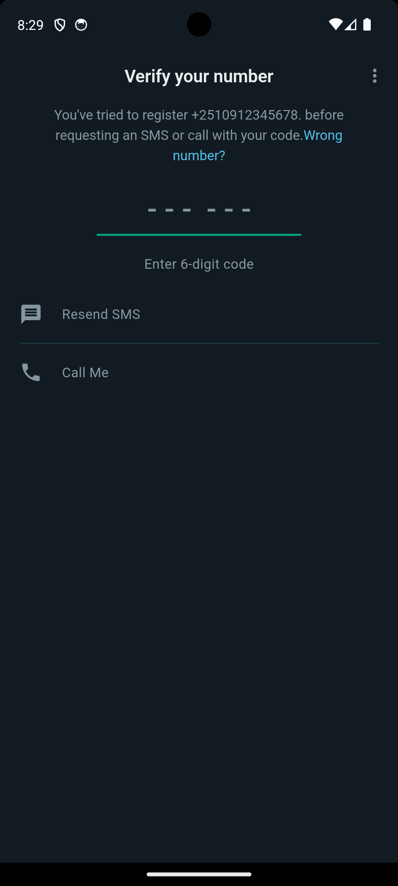
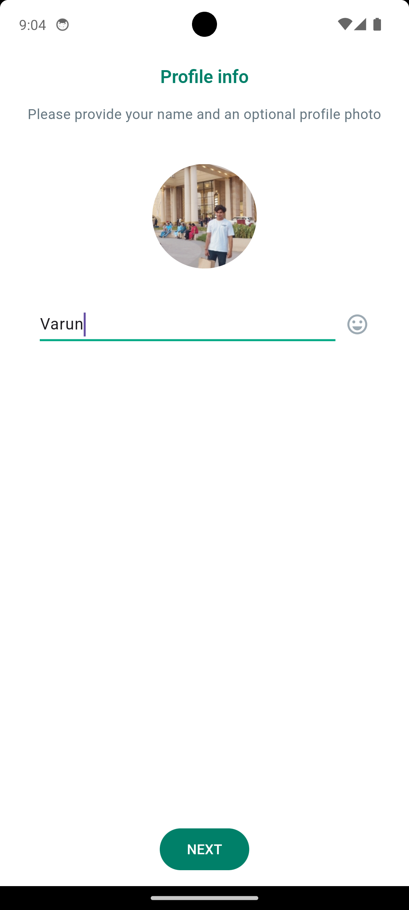

# WhatsApp Clone

This is a WhatsApp clone project currently under development. The project aims to replicate the basic functionalities of WhatsApp, such as messaging, profile management, and contacts handling.

## Features
- User Authentication
- Real-time Messaging
- Profile Management
- Contacts List
- Theming (Light and Dark Modes)

## Installation
To run this project locally, follow these steps:

1. Clone the repository:
   ```bash
   git clone https://github.com/th3varun/whatsapp_messenger.git

2. Navigate to the project directory:
   ```bash
   cd whatsapp_messenger

3. Install the dependencies:
   ```bash
   flutter pub get

4. Run the app:
   ```bash
   flutter run

## Usage

### Welcome
The welcome screen introduces the app to new users and provides options to select language and review privacy terms.

#### Screenshots:
- Welcome Page
<div align="center">
  
  
</div>

### Authentication
Users can register and log in using their phone numbers. After logging in, they can set up their profile information.

#### Screenshots:
- Login Page
<div align="center">
  
  
</div>

- Verification Page
<div align="center">
  
  
</div>

- User Info Page
<div align="center">
  
  
</div>

### Home
The home screen provides navigation to different sections like Chats, Status, and Calls.

#### Screenshots:
- Home Page
<div align="center">
  
  
</div>

### Contacts
Users can view and manage their contacts within the app.

#### Screenshots:
- Contacts Page
<div align="center">
  
  
</div>

### Chat
Users can send and receive messages in real-time. The chat interface supports various message types.

#### Screenshots:
- Chat Page
<div align="center">
  
  
</div>

- Profile Page
<div align="center">
  
  
</div>


## Technologies Used
- Flutter
- Firebase

## Contribution
Feel free to fork the project, make improvements, and send a pull request. For major changes, please open an issue first to discuss what you would like to change.

## License
This project is licensed under the MIT License. See the `LICENSE` file for details.

